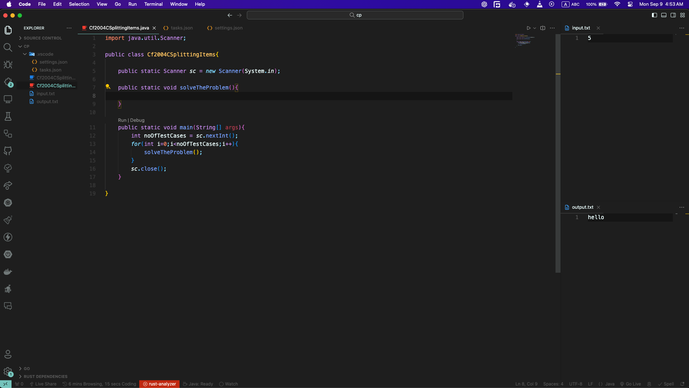

# VS Code Config

## Intra

This repository contains some configuration files for **VS Code** that will give you a better experience while practicing **competitive programming** in a sense of **easy input & output**.

## Behind The Scene

Generally we used to use **Code Blocks** for practicing cp back then. It has everything build in. You just need to create a cpp or c file and run the code by pressing the run button. They terminal comes up and you put the inputs and get the outputs in the terminal. You might be a good coder but I had to run and test my code multiple times to get the correct output. Also I was not a fan of codeblocks as it looks very odd. And at the same time, VS Code crosses my way. Then I started using it and I found it very useful. But the problem was, I had to run the code in terminal and give inputs and get outputs. So I thought of making a configuration file that will make my life easier. And here it is.

## How It Works

VS Code has some way of doing things. It has a concept of Work Spaces.You can open a folder as workspace and do your stuffs. You can also configure the work space according to your need. There is a `.vscode` folder in the workspace folder where you can put your configuration files. `settings.json` is the settings for your current workspace and another important file is `tasks.json` file which can be configured to build & run your code with some shortcuts. We have used this `tasks.json` file to make our life easier.

Basically we can set the commands that will run when the shortcut is being used. So, the config file includes building, running the code and then taking input from a file and giving output to another file. So, you just need to write your code, give inputs in the input file and press the shortcut. You will get the output in the output file.

## Supported OS

- Windows
- Linux
- MacOS

## Available Language Configurations

- [C/C++](Config-Files/C&C++/)
- [Python](Config-Files/Python/)
- [Java](Config-Files/Java/)
- [Dart](Config-Files/Dart/)
- [Go](Config-Files/Golang/)

## How To Configure

- [Windows](./windows.md)
- [Linux](./linux.md)
- [MacOS](./mac.md)

**Note:** The readme files are written for C/C++ only. You can follow the same steps for other languages too.

## How To Use

- Open your workspace **Folder** where you will code your shits.
  - Open VS Code, then you can go to `Menu -> File -> Open Folder ...`
  
  
- Create your `.c` or `.cpp` file, write code and give inputs in `input.txt` and press `Ctrl+Shift+b` and your output will be in the `output.txt` file.

### Notes

- Make sure your mouse cursor is **clicked** or **focused** on the **cpp file** editor while you are running your code.
- I have came to know that some new comers or vscode users sometimes just open the file in vscode instead of opening as folder and press `Ctrl+Shift+b` which will not work. So please open vscode in your desired folder.

# VS CODE Snippets

**This one is made for my personal usage, you can add functions as you wish and edit my name and doc.**

## Setup

- Select User Snippets (at top menubar, File/Code [for **mac**] > Preferences > User Snippets) and then select **cpp.json**.
  
- copy or replace the [cpp.json file](./Snippets/cpp.json) and save.

## Usage

- Creating a cpp file if you type **inc** and press **Tab** in your keyboard the **snippet** will load as i have set **prefix** as **inc** in my **json file** . (**You can edit as your own !**)
- This will make programming easy and fast .

## Snippets

- [C++](/Snippets/cpp.json)
- [Python](/Snippets/python.json)
- [Dart](/Snippets/dart.json)
- [Java](/Snippets/java.json)

Happy coding :3
